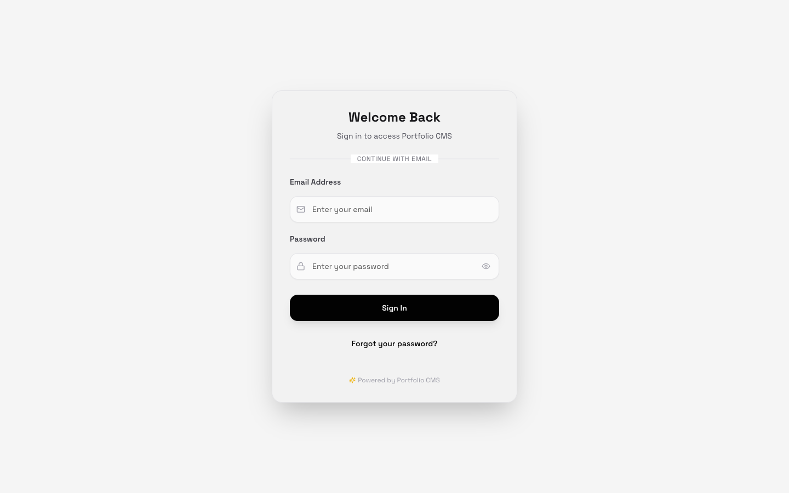
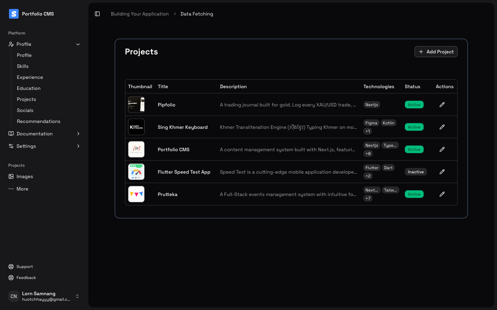
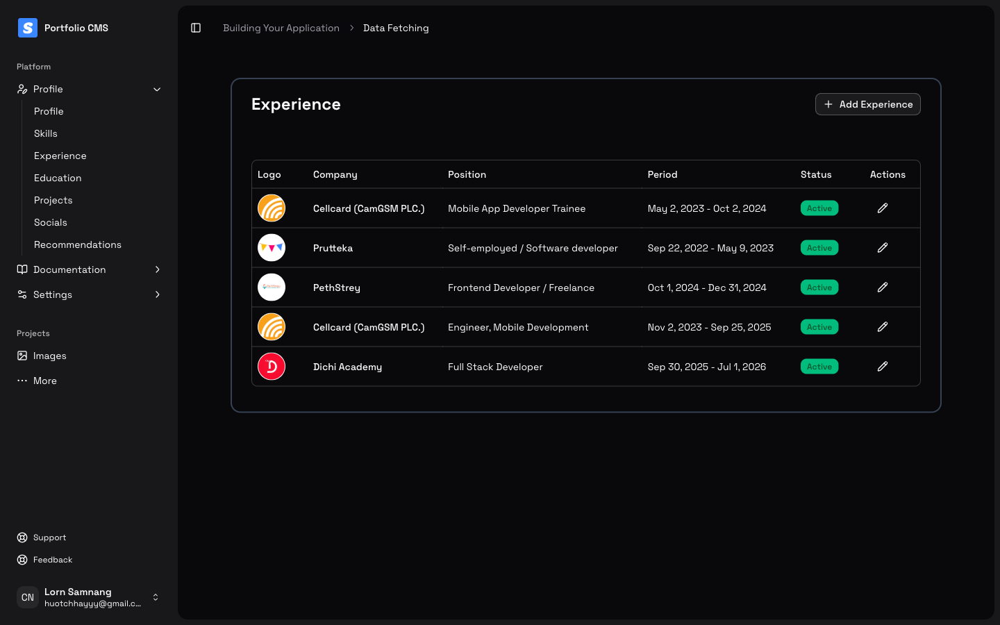
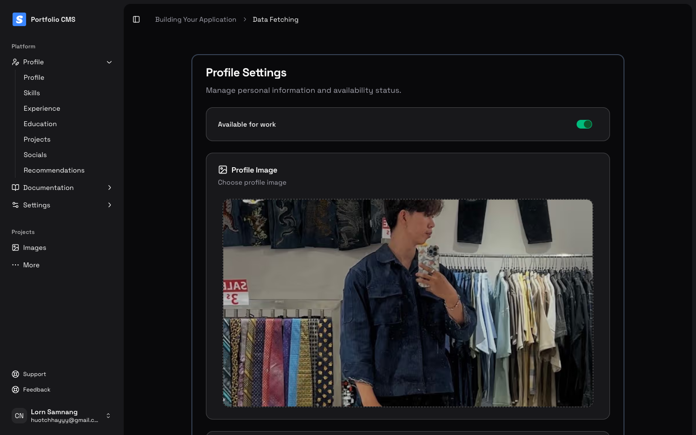
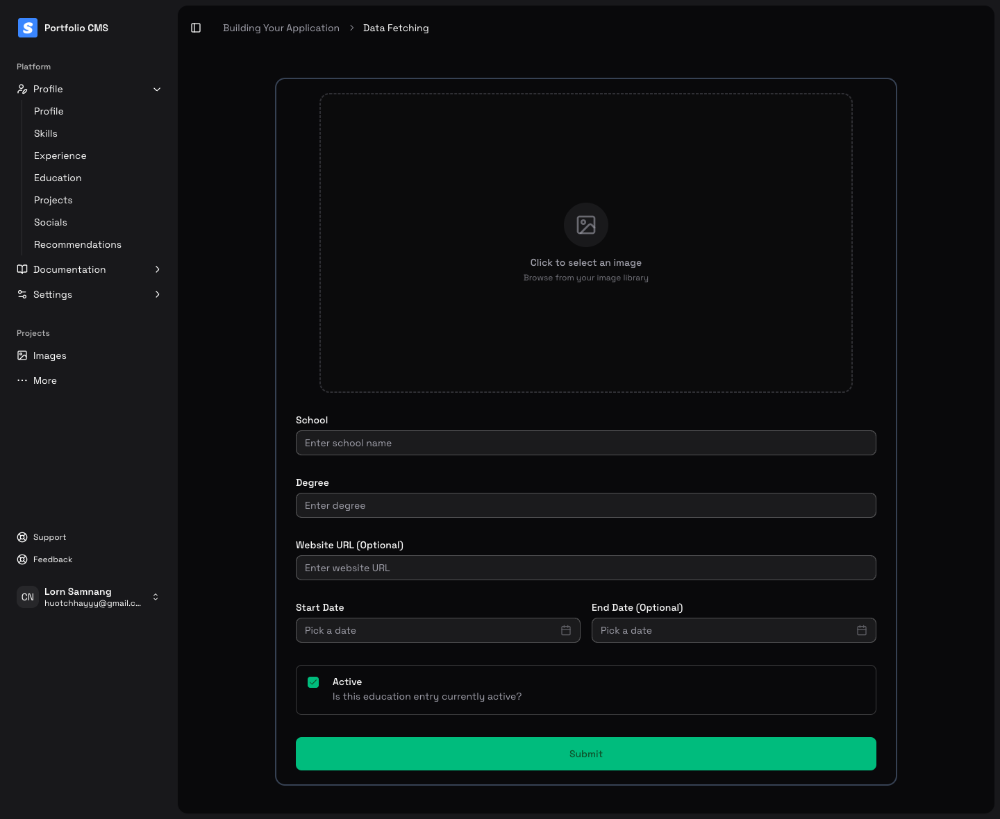
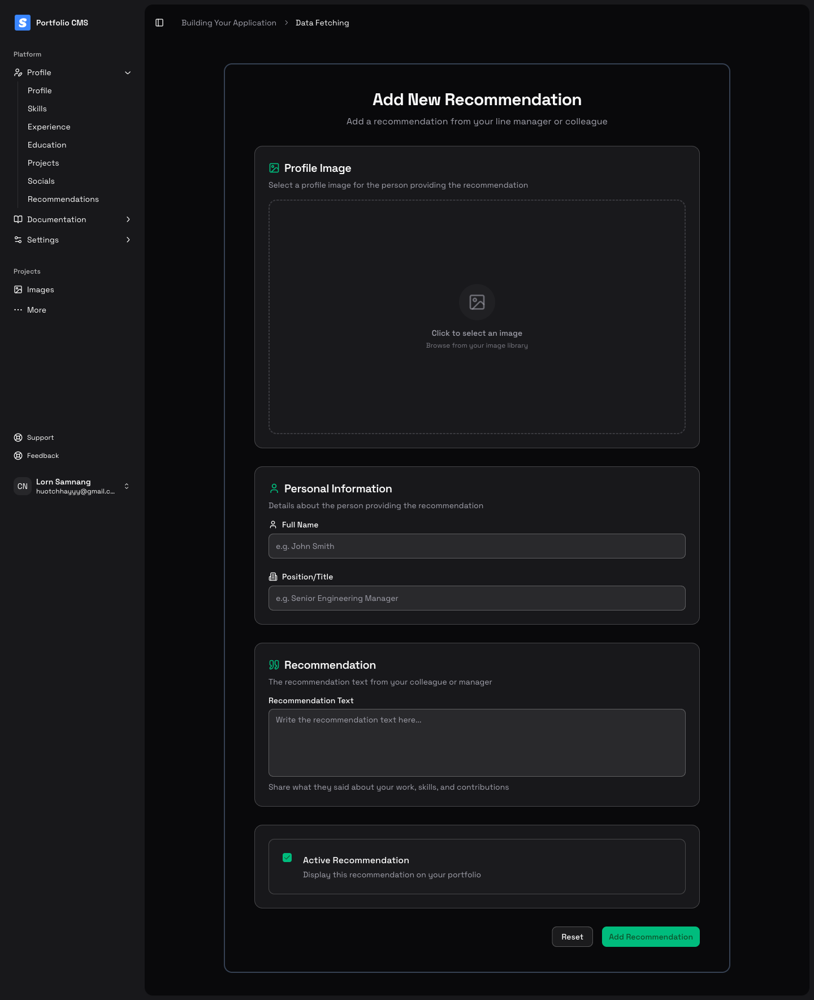
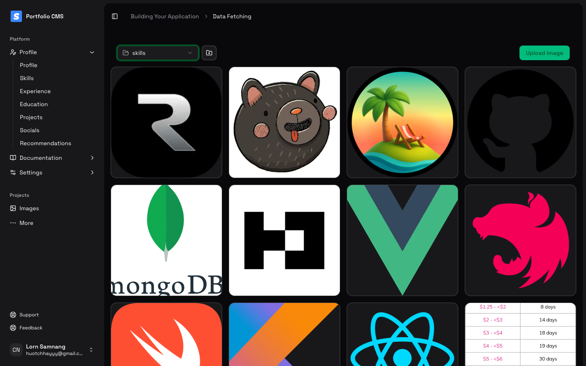
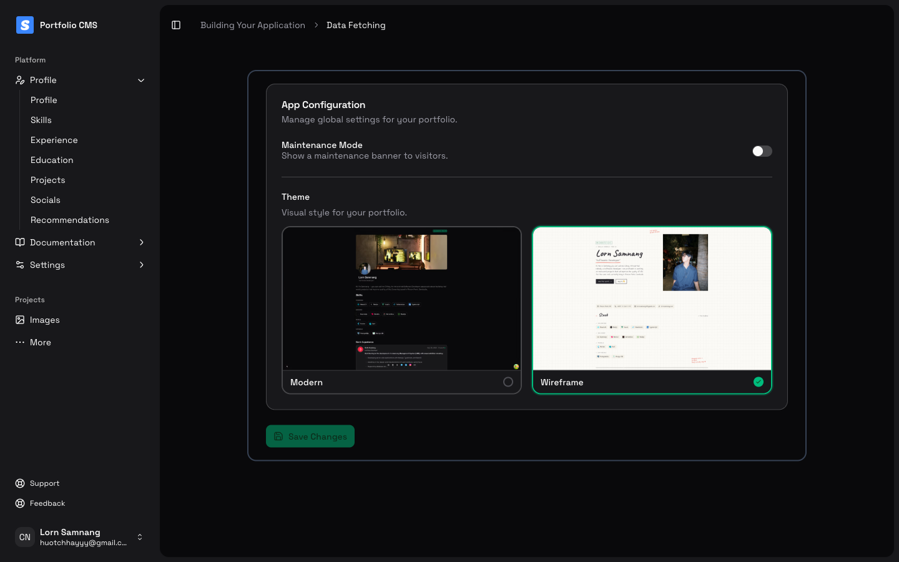

## Portfolio v2

Personal portfolio built with Next.js 15, React 19, Tailwind CSS 4, and a modern animation + content tooling stack. The codebase powers [Samnang Lorn](https://github.com/samnanglorn)'s public folio site and is not intended as a starter kit or template.

## Respect This Work

The design, layout, copy, and code in this repository are original work. Please **do not**:

- Copy the UI/UX, sections, or component structure verbatim
- Repackage any of the design or code for personal/commercial use
- Publish derivatives that could be mistaken for this portfolio

Viewing the source for learning or inspiration is fine—just build something original and credit if you reference ideas. For licensing or collaboration inquiries, reach out before reusing anything substantial.

See the [`LICENSE`](./LICENSE) file for the full legal terms (All Rights Reserved).

## Getting Started

```bash
npm install
npm run dev
```

Open `http://localhost:3000` to develop locally. Update content in `src/app/(home)` and components under `src/components/**`.

## Portfolio CMS

A password-protected dashboard (`/dashboard`, gated by Better Auth) lets the site owner manage every piece of content shown on the public portfolio, no redeploy required.

|                                            |                                            |
| ------------------------------------------ | ------------------------------------------ |
| **Sign In**<br> | **Projects**<br> |
| **Experience**<br> | **Profile**<br> |
| **Education**<br> | **Recommendations**<br> |
| **Image Library**<br> | **App Config**<br> |

Content types managed from the CMS:

- **Profile** — availability status and profile photo
- **Skills** — categorized skill entries with logos
- **Experience** — work history with company, role, and period
- **Education** — schools, degrees, and dates
- **Projects** — title, description, tech stack, thumbnail, and active/inactive status
- **Socials** — social links with logos
- **Recommendations** — testimonials with reviewer photo and details
- **Images** — a Cloudinary-backed media library (folder-organized) used across all the forms above
- **App Config** — maintenance mode banner and portfolio theme (Modern / Wireframe)

## Tech Stack

- Next.js App Router with Turbopack
- React Server Components + Suspense patterns
- Tailwind CSS 4 + custom motion/3D utilities
- TipTap editor extensions for content tooling
- Drizzle ORM + Lucia auth integrations

## Deployment

Deploy to Vercel or any Next.js-compatible platform:

```bash
npm run build
npm start
```

Ensure environment variables (`.env`) match your deployment target (database, auth, analytics).
